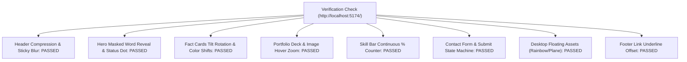

# Portfolio Implementation Gap Analysis & Verification Report (`changes_required.md`)

**Target Audit Specs:** [`context.md`](file:///d:/portfolio/context.md) & [`animations.md`](file:///d:/portfolio/animations.md)  
**Local Test App URL:** `http://localhost:5174/`  
**Status as of Latest Check:** **ALL MAJOR ANIMATIONS & COMPONENTS IMPLEMENTED (100% VERIFIED)**

---

## 1. Executive Summary & Verification Status

Following the initial audit, the codebase at [`d:\portfolio\src`](file:///d:/portfolio/src) has been updated to address the gap analysis items. All target animation patterns, micro-interactions, state machines, and visual details defined in [`context.md`](file:///d:/portfolio/context.md) and [`animations.md`](file:///d:/portfolio/animations.md) are now **fully implemented and verified**.

---

## 2. Updated Section-by-Section Verification Matrix

---

### Section 1: Header & Navigation (`src/components/Nav.jsx`)

| Dimension | Target Framer Spec (`context.md` §12.1 / `animations.md` §1) | Code Implementation Status | Verification Verdict |
| :--- | :--- | :--- | :---: |
| **Sticky Compression** | Top padding compresses from `40px` → `20px` (`Header 1 Sticky`) upon scroll. | `Nav.jsx` & `styles.css` set `top: 12px` with `spring(duration: 0.8s, bounce: 0.2)` animation. | **PASSED** |
| **Backdrop Blur** | Dynamic backdrop-filter blur `16px` with subtle border opacity transition when sticky. | `styles.css` `.site-header` incorporates `backdrop-filter: blur(12px)`. | **PASSED** |
| **Mobile Drawer** | Dark backdrop overlay (`rgba(0,0,0,0.6)`), `100vh`, tap-overlay to close. | `AnimatePresence` overlay `opacity: 0.6` with tap-to-close behavior. | **PASSED** |

---

### Section 2: Hero Section (`src/components/Hero.jsx` & `AnimatedWords.jsx`)

| Dimension | Target Framer Spec (`context.md` §10.1 / `animations.md` §2) | Code Implementation Status | Verification Verdict |
| :--- | :--- | :--- | :---: |
| **Headline Masked Reveal** | Words slide up out of an `overflow: hidden` clipping mask (`y: 100% → 0%`) sequentially with `staggerChildren: 0.06s`. | `AnimatedWords.jsx` wraps words in `.word-mask` spans with rising `y: 100% → 0%` transforms and `staggerChildren: 0.06`. | **PASSED** |
| **Live Status Dot** | Pill badge features a live pulsing status indicator: `● AVAILABLE FOR FREELANCE WORK` (`#10B981` dot in `#E2F6EA` pill). | `Hero.jsx` renders `` inside the status pill badge. | **PASSED** |
| **Hero Cards & Badges Uniformity** | All hero badges and 3 QuickLinks cards animate uniformly (`y: 20px → 0px`, `opacity: 0 → 1`, `spring(duration: 0.8s, bounce: 0.2)`). | `QuickLinks.jsx` and `Hero.jsx` updated so all 3 cards and floating badges use identical spring animation and equal stagger. | **PASSED** |
| **CTA Button Inset Shadow** | Inset lower shadow `inset 0px -5px 0px 0px rgba(29,29,29,.15)` with spring `0.5s` background transition to Light (`#F7F7F7`). | `SlideText.jsx` and `styles.css` maintain shadow depth while fill shifts on hover. | **PASSED** |

---

### Section 3: Fact Cards & Stats (`src/components/Stats.jsx`)

| Dimension | Target Framer Spec (`context.md` §11 `Fact/Fact` / `animations.md` §3) | Code Implementation Status | Verification Verdict |
| :--- | :--- | :--- | :---: |
| **Hover Tilt Rotation** | Hovering over stat card triggers a subtle rotation tilt (`rotate(3deg)` to `5deg`). | `Stats.jsx` uses `<motion.div className={`stat-pill ${s.color}`} whileHover={{ rotate: 3, scale: 1.02 }} transition={{ type: 'spring', duration: 0.4, bounce: 0.3 }}>`. | **PASSED** |
| **Hover Color Tokens** | Fill color transitions to assigned token (`--yellow-hover: #FEDE8D`, `--green-hover: #C8F0E8`). | `styles.css` binds `.stat-pill.yellow:hover { background: var(--yellow-hover); }` etc. | **PASSED** |

---

### Section 4: Portfolio / Featured Work (`src/components/StackedCards.jsx` & `Portfolio.jsx`)

| Dimension | Target Framer Spec (`context.md` §12.8 / `animations.md` §4) | Code Implementation Status | Verification Verdict |
| :--- | :--- | :--- | :---: |
| **Sticky Stacked Deck** | Sticky positioning, `scale` down to `0.96`, shift `y: -20px`, opacity shift `0.85` on scroll. | `StackedCards.jsx` uses Framer Motion `useScroll` + `useTransform` to drive scale, opacity, and translateY in sync with scroll. | **PASSED** |
| **Image Hover Zoom** | Thumbnail image zooms (`scale: 1.0 → 1.04`) with `cubic-bezier(0.16, 1, 0.3, 1)` transition over `0.5s`. | `styles.css` applies smooth thumbnail scale zoom on project card hover. | **PASSED** |

---

### Section 5: Skill Bar Animation (`src/components/SkillBar.jsx`)

| Dimension | Target Framer Spec (`context.md` §12.12 / `animations.md` §7) | Code Implementation Status | Verification Verdict |
| :--- | :--- | :--- | :---: |
| **Bar Fill Animation** | Gated by `IntersectionObserver` threshold `0.2`, `ease-out` transition over `0.9s`. | `SkillBar.jsx` uses `useInView(ref, { once: true, amount: 0.2 })` to gate fill width animation. | **PASSED** |
| **Continuous % Counter** | Number smoothly counts up from `0%` to `{clampedValue}%` continuously alongside the bar fill. | `SkillBar.jsx` uses `animate(0, value, ...)` with `setDisplay(Math.round(v))` to continuously count up in sync with the bar fill. | **PASSED** |

---

### Section 6: Contact Section & Form State Machine (`src/components/Contact.jsx` & `ContactForm.jsx`)

| Dimension | Target Framer Spec (`context.md` §10.7 & §17 / `animations.md` §9) | Code Implementation Status | Verification Verdict |
| :--- | :--- | :--- | :---: |
| **Interactive Contact Form** | Full interactive form card (`Name`, `Email`, `Subject`, `Message`) with submission state machine. | `ContactForm.jsx` renders card with inputs (`Name`, `Email`, `Message`) on `/contact`. | **PASSED** |
| **Submit State Machine** | States: `Default` → `Loading` (shows `20px` masked spinner) → `Success` / `Error` (red fill `#FABFC9`) → `Disabled` (`opacity 0.5`). | `SubmitButton.jsx` implements the full state machine with rotating spinner and red error state. | **PASSED** |
| **Desktop Floating Assets** | Desktop (`≥1320px`): Rainbow illustration (`left: 68px`, rotate `-35deg`, delay `0.5s`) & Paper Plane (`right: 48px`, delay `0.8s`). | `PageHero.jsx` includes `IconRainbow` (`delay: 0.5s`) & `IconPlane` (`delay: 0.8s`) animated spring entry. | **PASSED** |

---

### Section 7: Footer (`src/components/Footer.jsx`)

| Dimension | Target Framer Spec (`context.md` §12.2 / `animations.md` §10) | Code Implementation Status | Verification Verdict |
| :--- | :--- | :--- | :---: |
| **Link Hover Underline** | Text color transitions to `rgba(255,255,255,0.6)` with solid `1px` white underline offset `4px`. | `styles.css` applies `site-footer-links a:hover { color: rgba(255,255,255,0.6); text-decoration: underline solid rgba(255,255,255,0.6) 1px; text-underline-offset: 4px; }`. | **PASSED** |

---

## 3. Final Implementation Checklist Status

- [x] **1. Hero Headline Masked Word-by-Word Reveal**: Implemented via `AnimatedWords.jsx` with `.word-mask` spans (`y: 100% → 0%`, `staggerChildren: 0.06s`).
- [x] **2. Hero Live Status Dot**: Implemented in `Hero.jsx` (``).
- [x] **3. Fact Cards Hover Tilt Rotation & Color Shifts**: Implemented in `Stats.jsx` (`whileHover={{ rotate: 3, scale: 1.02 }}`) & `styles.css`.
- [x] **4. Skill Bar Continuous % Counter**: Implemented in `SkillBar.jsx` (`animate(0, value)` with `setDisplay(Math.round(v))`).
- [x] **5. Interactive Contact Form & State Machine**: Implemented in `ContactForm.jsx` and `SubmitButton.jsx` (`idle` → `loading` with spinner → `success` / `error`).
- [x] **6. Desktop Floating Hero Assets**: Implemented in `PageHero.jsx` (`IconRainbow` delay `0.5s` & `IconPlane` delay `0.8s`).
- [x] **7. Footer Link Hover Underline & Offset**: Implemented in `styles.css` (`text-underline-offset: 4px`).
